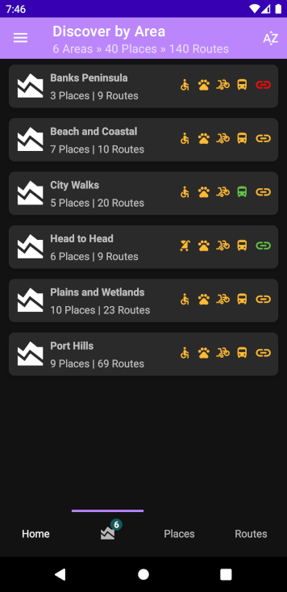
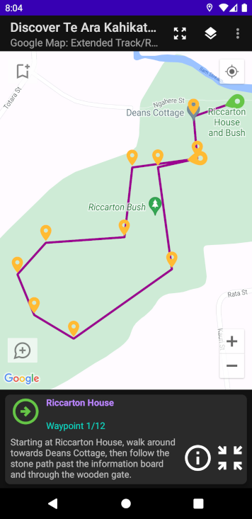
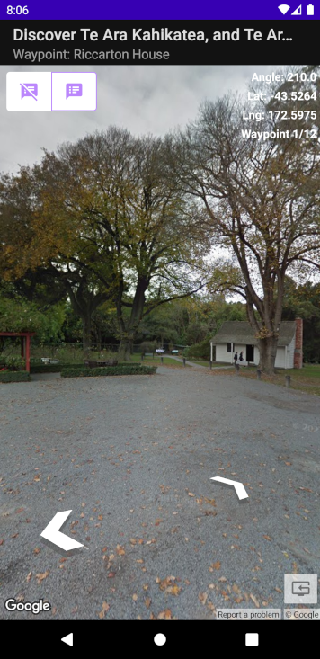

# DiscoverNavDrawer
Discover Christchurch, Android app (Navigation Drawer version)

Discover *Christchurch, New Zealand* with this Google Maps-based Android application.

TLDR: the libraries implemented indicate technologies used within the app ...

**Android/Google libraries**:
* 99% Kotlin programming language
* Dagger/Hilt dependency injection
* Maps platform Secrets plugin to secure Google API keys
* AndroidX Core
* AppCompat compatibility
* Material Design
* Constraint Layout
* Kotlinx Coroutines
* Activity Extensions
* Fragment Extensions
* Grid Layout
* Google GSON
* Lifecycle+Extensions
* Location Services
* Maps SDK Extensions+Utils
* Navigation Component+Extensions
* RecyclerView
* Room Database+Extensions
* Window Manager

**Third party libraries**:
* [Collapsing Toolbar Layout](https://github.com/HendraAnggrian/collapsingtoolbarlayout-subtitle)
* [Binary-Finary FabToast](https://android-arsenal.com/details/1/6589)
* [BumpTech Glide](https://github.com/bumptech/glide)
* [TicoFab GPX Parser](https://github.com/ticofab/android-gpx-parser)
* [Animated Bottom Bar](https://android-arsenal.com/details/1/8058)
* [DroidIT Flat Radio Group](https://github.com/droid-it/Flat-Radio-Group)

Data/view binding: true

Minimum SDK version: 24

Code comments are limited, as I believe that the code should speak for itself, with descriptive function/variable names & clear-cut data-types.

**App Features**

140 urban/rural walking routes/tracks, listed by area & place

Can be filtered by accessibility, dog-friendly, public transport, return journeys, shared-use

Searchable by name or feature, as above

Each route/track includes photo, map, street view (if available) & helpful info: brief description, distance, directions, start/end points, nearby conveniences (if available), dog bylaws, etc.

Nearby routes/tracks are linked internally

Multi-day walks:
1. Christchurch 360
2. Coastal Pathways
3. Crater Rim walkways
4. Head to Head walkway

Community Resources:
* Battery Recyclers
* CCC Facilities
* Dog bylaws by Area
* Drinking Fountains
* Free WiFi
* Fruit Trees
* Heritage Sites
* MTB Tracks
* Public Conveniences
* Public Parks
* Street Art
* Urban Play

All of the above are linked with built-in Google maps

Favourites (multiple view-types are displayed in one list)

Icons legend and App settings. See below for screenshots:

